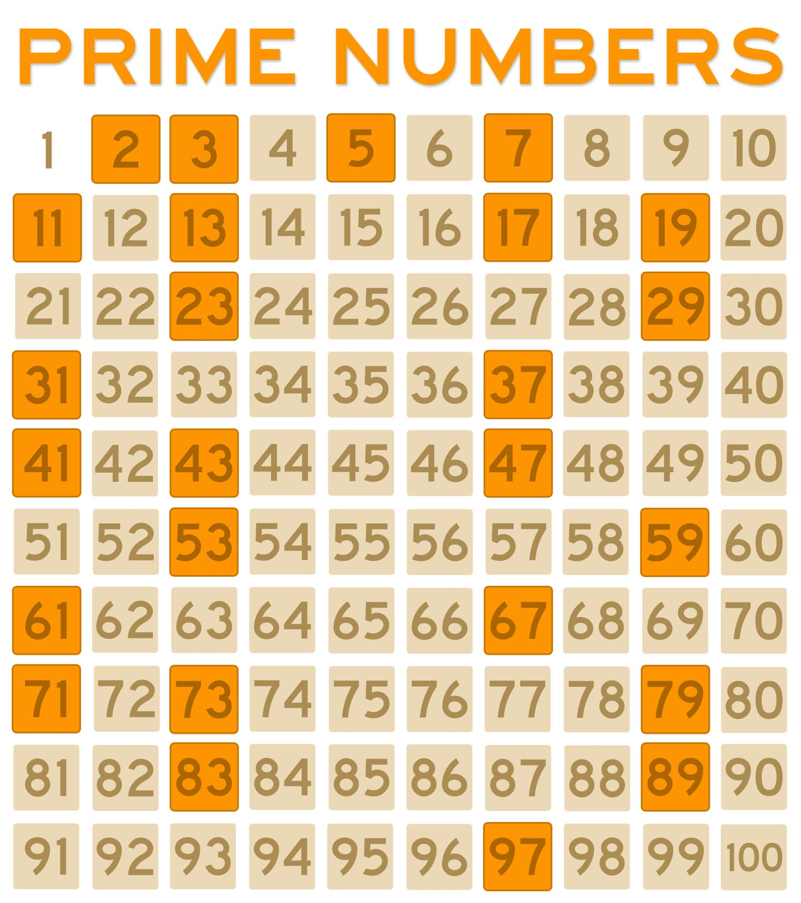

### Hexlet tests and linter status:

# my Maintainability Badge

## Добро пожаловать в Brain Games! 
***

### Вашему вниманию предлагается 5 игр.   

### _*Для установки Brain Games:*_
 + загрузите пакет на свой компьютер 
 + введите в терминале команду: pip install brain-games --user

### _*Для запуска игры:*_  
* введите в командную строку терминала команду, соответствующую выбранной игре:

><li>Игра "ПРОВЕРКА НА ЧЕТНОСТЬ"      - команда: brain-even</li>
><li>Игра "КАЛЬКУЛЯТОР"               - команда: brain-calc</li>
><li>Игра "НАИБОЛЬШИЙ ОБЩИЙ ДЕЛИТЕЛЬ" - команда: brain-gcd</li>
><li>Игра "АРИФМЕТИЧЕСКАЯ ПРОГРЕССИЯ" - команда: brain-progression</li>
><li>Игра "ПРОСТОЕ ЛИ ЧИСЛО"          - команда: brain-prime</li>
***

[пример игры  
**_КАЛЬКУЛЯТОР_**](https://asciinema.org/a/aa42Ad1igMSTfdZkA4F7z76z8)

пример игры  
**_НАИБОЛЬШИЙ ОБЩИЙ ДЕЛИТЕЛЬ_**

пример игры  
[**_АРИФМЕТИЧЕСКАЯ ПРОГРЕССИЯ_**](https://asciinema.org/a/UKXUKBZbxSxKyiLG4scHgh9QD)

пример игры  
**_ПРОСТОЕ ЛИ ЧИСЛО_**

